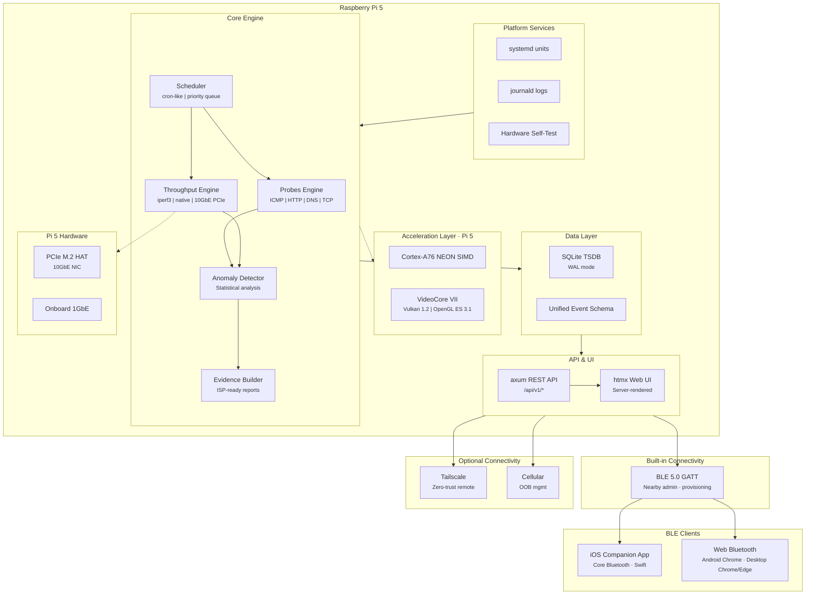
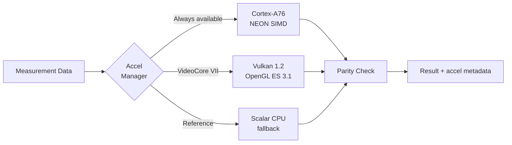
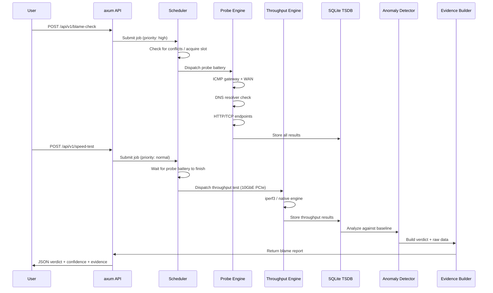

<p align="center">
  <h1 align="center">PacketParamedic</h1>
  <p align="center">
    <strong>Appliance-grade network diagnostics for your home and small office.</strong><br>
    <em>Pi 5 exclusive. ARM NEON + GPU accelerated. 10GbE-ready. Scheduled diagnostics. Built in Rust.</em>
  </p>
  <p align="center">
    <a href="https://blueoakcouncil.org/license/1.0.0"></a>
    
    
    
    
    
    
    
    
    
    
    
    
    
    
    
    
    
    
  </p>
</p>

---

> **Pi 5 only.** PacketParamedic targets Raspberry Pi 5 exclusively. No Pi 4, no Pi 3, no backward compatibility. Forward-looking, no legacy. Pi 5 gives us native PCIe for 10GbE, Cortex-A76 with guaranteed NEON, VideoCore VII with Vulkan 1.2, and the thermal/power headroom to sustain line-rate testing.

---

## What is PacketParamedic?

PacketParamedic is a Raspberry Pi 5-based network diagnostic appliance that answers one question with evidence:

> **"Is it my Wi-Fi, my router, or my ISP?"**

It runs unattended, collects structured measurements over time, detects anomalies, and produces shareable evidence bundles you can hand to your ISP or use to troubleshoot yourself.

### Key Capabilities

- **Blame attribution** -- Distinguishes LAN, Wi-Fi, router, DNS, and ISP issues with evidence. Uses a specialized **Logistic Regression classifier** trained on synthetic failure patterns to output probabilities (e.g., "98% generic ISP failure").
- **Continuous monitoring** -- Scheduled ICMP, HTTP, DNS, and TCP probes build a baseline over days and weeks.
- **Incident detection** -- Statistical anomaly detection flags latency spikes, packet loss, route changes, and DNS shifts.
- **10GbE throughput testing** -- Stress test LAN links and measure WAN bandwidth up to 10 Gigabit Ethernet via Pi 5 PCIe, using iperf3 or a native Rust engine.
- **Scheduled diagnostics** -- Cron-like scheduling for all probes and tests with bandwidth-aware coordination, priority queues, and configurable test windows.
- **ISP speed tier validation** -- Automated recurring speed tests that track whether your ISP delivers the bandwidth you pay for, with historical trending.
- **Evidence bundles** -- Export timestamped, redacted reports suitable for ISP support tickets.
- **Hardware self-test** -- Validates Pi 5 hardware (RAM, Board), Wi-Fi adapters (Monitor Mode support), 2.5GbE/Multi-Gig NICs, thermals, and power integrity before testing.
- **Hardware acceleration** -- Cortex-A76 NEON SIMD for compute-heavy paths; VideoCore VII GPU offload (Vulkan 1.2 / OpenGL ES 3.1) where beneficial. Policies ensure every op has a scalar CPU fallback.
- **Appliance-grade reliability** -- Survives power cuts, manages disk space, and runs headless with zero maintenance.

---

## Architecture



### Acceleration Pipeline



### Diagnostic Flow



---

## Tech Stack

| Layer | Choice | Rationale |
|---|---|---|
| **OS** | Raspberry Pi OS Lite (Bookworm) -- Pi 5 only | Native Pi 5 support; Cortex-A76 + VideoCore VII + PCIe |
| **Runtime** | Rust + Tokio + axum + tower | Lightweight async stack; low memory, safe concurrency |
| **Acceleration** | Cortex-A76 NEON SIMD + VideoCore VII (Vulkan 1.2 / OpenGL ES 3.1) | Pi 5 native hardware acceleration with CPU reference fallback |
| **Throughput** | iperf3 (wrapped) + native Rust fallback | Industry-standard 10GbE line-rate testing; native fallback for minimal deployments |
| **10GbE** | PCIe M.2 HAT NIC | Pi 5 native PCIe -- true 10GbE without USB bottlenecks |
| **Scheduling** | In-process cron engine (Tokio) | Bandwidth-aware coordination of all probes and tests; no external scheduler dependency |
| **Storage** | SQLite (WAL mode) | Zero-ops local-first event store; crash-safe concurrent access |
| **UI** | Server-rendered HTML + htmx | No SPA build pipeline; fast on low-power hardware |
| **Observability** | `tracing` + `tracing-journald` | Structured logs into journald; great for support bundles |
| **Services** | systemd units + tmpfiles.d | Appliance-grade supervision, easy rollback and diagnostics |
| **Remote admin** | Tailscale (optional) | Zero-trust, no inbound ports, WireGuard encrypted |
| **BLE** | BlueZ + bluer | Pi 5 built-in Bluetooth 5.0; nearby provisioning and recovery via GATT |
| **Cellular** | SIM HAT/modem (optional) | Out-of-band management when WAN is down |

### BLE Client Platform Compatibility

PacketParamedic exposes a BLE GATT service for nearby provisioning and admin. How you connect depends on your client platform:

| Platform | App required? | Recommended path | Notes |
|---|---|---|---|
| **iOS** | Yes | Native iOS companion app (Core Bluetooth + Swift) | Web Bluetooth is not available in iOS Safari or PWAs. A native companion app is required. |
| **Android** | No | Web UI + Web Bluetooth API in Chrome | Permissions/UX can be finicky; still workable for provisioning. No separate app install needed. |
| **Desktop (macOS / Windows / Linux)** | No | Web UI + Web Bluetooth in Chrome or Edge | Requires HTTPS or secure context. Hardware/OS BLE stacks vary. |

> **Why a native iOS app?** Apple does not implement the Web Bluetooth API in Safari (or any iOS browser engine, since all iOS browsers use WebKit). The only way to interact with the PacketParamedic BLE GATT service from an iPhone or iPad is through a native app using Apple's Core Bluetooth framework.

---

## Getting Started

### Prerequisites

- **Raspberry Pi 5** (4 GB+ RAM recommended)
- Raspberry Pi OS Lite (Bookworm, 64-bit)
- Rust toolchain (`rustup` -- see [rustup.rs](https://rustup.rs))
- SQLite 3.35+
- iperf3 3.x (optional -- native Rust fallback available)
- 10GbE PCIe NIC via M.2 HAT (optional -- for high-speed LAN/WAN testing)

### Build

```bash
# Clone the repository
git clone https://github.com/ParkWardRR/PacketParamedic.git
cd PacketParamedic

# Build in release mode (enables NEON auto-vectorization on Cortex-A76)
cargo build --release

# Run the self-test (checks Pi 5 hardware, Wi-Fi, 10GbE NIC, thermals, acceleration)
./target/release/packetparamedic self-test
```

### Cross-compile for Pi 5 (from x86)

```bash
# Install the target
rustup target add aarch64-unknown-linux-gnu

# Build with cross (handles sysroot and linker)
cross build --release --target aarch64-unknown-linux-gnu
```

### Run

```bash
# Start the daemon (uses systemd in production)
./target/release/packetparamedic serve

# Quick blame check from CLI
./target/release/packetparamedic blame-check
```

The web UI is available at `http://<pi-ip>:8080` once the server is running.

---

## Usage

### CLI

```bash
# Run hardware self-test (Pi 5 board, Wi-Fi, 10GbE NIC, thermals, NEON/GPU)
packetparamedic self-test

# Run a blame check ("Is it me or my ISP?")
packetparamedic blame-check

# Run a 10GbE LAN stress test against a peer
packetparamedic speed-test --mode lan --peer 192.168.1.100 --duration 60s

# Run a WAN bandwidth test
packetparamedic speed-test --mode wan

# Export an evidence bundle for your ISP
packetparamedic export-bundle --output report.zip

# List all scheduled jobs
packetparamedic schedule list

# Add a daily speed test at 3am
packetparamedic schedule add --name "nightly-speed" --cron "0 3 * * *" --test speed-test

# Show what will run in the next 24 hours
packetparamedic schedule dry-run --hours 24

# Check service status
systemctl status packetparamedic
```

### API

All functionality is exposed via a local REST API:

```bash
# Trigger a blame check
curl -X POST http://localhost:8080/api/v1/blame-check

# Get the latest self-test report
curl http://localhost:8080/api/v1/self-test/latest

# Trigger a LAN throughput test (10GbE)
curl -X POST http://localhost:8080/api/v1/speed-test \
  -H 'Content-Type: application/json' \
  -d '{"mode": "lan", "peer": "192.168.1.100", "duration_secs": 60}'

# Trigger a WAN bandwidth test
curl -X POST http://localhost:8080/api/v1/speed-test \
  -d '{"mode": "wan"}'

# List recent incidents
curl http://localhost:8080/api/v1/incidents?limit=10

# List all schedules
curl http://localhost:8080/api/v1/schedules

# Create a recurring schedule
curl -X POST http://localhost:8080/api/v1/schedules \
  -H 'Content-Type: application/json' \
  -d '{"name": "nightly-speed", "cron": "0 3 * * *", "test": "speed-test", "enabled": true}'

# Dry-run: preview next 24h of scheduled activity
curl http://localhost:8080/api/v1/schedules/dry-run?hours=24

# Export a support bundle
curl -X POST http://localhost:8080/api/v1/export/bundle -o bundle.zip
```

---

## Project Structure

```
PacketParamedic/
├── src/
│   ├── main.rs            # Entry point and CLI
│   ├── lib.rs             # Library root for testability
│   ├── api/               # axum routes and handlers
│   ├── probes/            # ICMP, HTTP, DNS, TCP probe implementations
│   ├── storage/           # SQLite schema, queries, migrations
│   ├── detect/            # Anomaly detection and incident grouping
│   ├── evidence/          # Report and bundle generation
│   ├── selftest/          # Hardware, Wi-Fi, 10GbE, thermal self-test
│   ├── accel/             # Acceleration manager (NEON / GPU / CPU fallback)
│   ├── throughput/        # iperf3 wrapper + native Rust throughput engine
│   └── scheduler/         # Cron-like scheduling engine with priority coordination
├── templates/             # HTML templates for htmx UI
├── static/                # CSS, minimal JS
├── config/                # Default schedule profiles (TOML)
├── systemd/               # Unit files for deployment
├── tests/                 # Integration and soak test harnesses
├── benches/               # Acceleration and throughput benchmarks
├── ios/                   # iOS companion app (Swift + Core Bluetooth)
│   ├── PacketParamedic/   # Xcode project
│   └── README.md          # iOS-specific build and usage instructions
├── roadmap.md             # Development roadmap (checklist)
├── CONTRIBUTING.md        # Development plan, standards, and best practices
└── README.md
```

---

## 10GbE Throughput Testing

PacketParamedic supports high-speed throughput testing up to 10 Gigabit Ethernet via the Pi 5's native PCIe bus.

### Hardware

| Speed | Hardware | Interface | Notes |
|---|---|---|---|
| 1 GbE | Onboard Ethernet | Built-in | Always available on Pi 5 |
| 10 GbE | PCIe NIC via M.2 HAT | PCIe gen 2 x1 | True 10GbE; no USB bottleneck |

> Pi 5's PCIe gen 2 x1 lane provides ~5 GT/s (practical ~3.9 Gbps after overhead with a single lane). For full 10GbE line rate, use a NIC that supports PCIe gen 3 or leverage the Pi 5's external PCIe connector where available. PacketParamedic auto-detects your actual negotiated link speed and adjusts test parameters accordingly.

### Test Modes

| Mode | Description |
|---|---|
| **LAN Stress** | Sustained throughput between two LAN peers (requires iperf3 server on peer) |
| **WAN Bandwidth** | Throughput to remote iperf3 servers or public speed test infrastructure (Ookla, Cloudflare, M-Lab) |
| **Bidirectional** | Simultaneous upload + download for full-duplex validation |
| **Multi-stream** | Parallel TCP streams (1--16) to test for per-flow bottlenecks |
| **Endurance** | Long-duration runs (1h, 24h) with thermal and CPU monitoring |

### Safety

All throughput tests enforce:
- Thermal monitoring with auto-abort on CPU throttle.
- Mutual exclusion: only one throughput test runs at a time.
- Test windows: bandwidth-heavy tests can be restricted to off-peak hours.
- Rate limits: WAN tests respect configurable daily bandwidth budgets.

---

## Scheduling

PacketParamedic includes a built-in scheduling engine for all probes and tests.

### Default Schedules

| Schedule | Interval | Test | Adjustable |
|---|---|---|---|
| Gateway ping | Every 60s | ICMP to gateway | Yes |
| DNS check | Every 5 min | DNS resolver timing | Yes |
| HTTP check | Every 5 min | HTTP reachability | Yes |
| Quick speed test | Daily (randomized) | Light WAN throughput | Yes |
| Full blame check | Weekly | Complete probe battery | Yes |

### Features

- **Cron syntax** -- Standard 5-field cron expressions for recurring schedules.
- **One-shot triggers** -- Run any test immediately via API or CLI.
- **Bandwidth-aware** -- Throughput tests never overlap; probes yield to speed tests.
- **Priority queue** -- blame-check > probes > speed tests > stress tests. User-triggered tests preempt scheduled work.
- **Test windows** -- Restrict heavy tests to defined hours (e.g., 02:00--05:00).
- **Bandwidth budgets** -- Limit total daily/weekly WAN bandwidth consumed by testing.
- **Missed-run detection** -- Logs when a scheduled run was missed due to downtime.
- **Dry-run preview** -- See what will run in the next N hours before it happens.

---

## Acceleration

PacketParamedic uses Pi 5 hardware acceleration natively:

| Tier | Technology | Use Case |
|---|---|---|
| **SIMD** | Cortex-A76 NEON (ASIMD) -- always available | Batch metric computation, statistical analysis |
| **GPU Compute** | VideoCore VII -- OpenGL ES 3.1 | Parallel data processing where beneficial |
| **GPU Compute** | VideoCore VII -- Vulkan 1.2 | Compute shaders for heavy analysis workloads |

**Correctness guarantee:** Every accelerated codepath has a reference CPU implementation. Both must produce identical results. The acceleration manager records which path was used for every operation, ensuring reproducible diagnostics.

---

## Contributing

Contributions are welcome. Please read [`CONTRIBUTING.md`](CONTRIBUTING.md) for coding standards, branch conventions, and testing requirements before submitting a PR.

### Quick Guidelines

1. **Fork and branch** from `main`.
2. **Pi 5 only** -- do not add codepaths for older Pi models.
3. **Write tests** for new functionality.
4. **Run `cargo clippy` and `cargo fmt`** before committing.
5. **Keep PRs focused** -- one feature or fix per PR.
6. **Document "why"** in commit messages, not "what".
7. **Backend first** -- build every backend function before touching the UI. Then front end optimization, then back end optimization.

---

## Security

PacketParamedic is designed as a network appliance with a strong security posture:

- No default passwords; authentication required for all API access.
- Minimal open ports (only the local web UI port by default).
- All actions are auditable via journald.
- Optional features (monitor mode, injection testing) require explicit opt-in.
- Tailscale integration uses zero-trust networking with no inbound WAN ports.
- Each systemd service runs with least-privilege capabilities (`CAP_NET_RAW`, `CAP_NET_ADMIN`).
- Supply chain secured via `cargo audit` + `cargo deny` on every build.

To report a security issue, please open a private advisory on GitHub.

---

## License

[Blue Oak Model License 1.0.0](https://blueoakcouncil.org/license/1.0.0) (SPDX: `BlueOak-1.0.0`)
