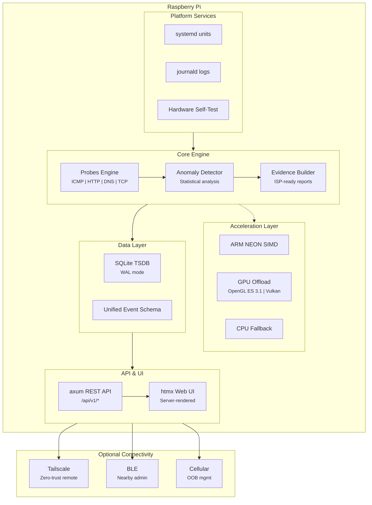
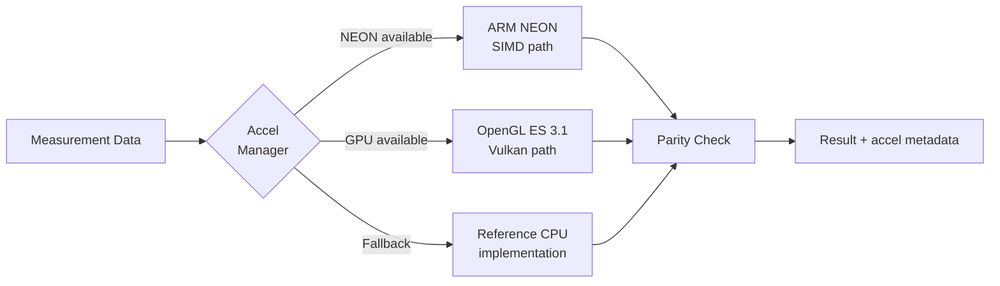
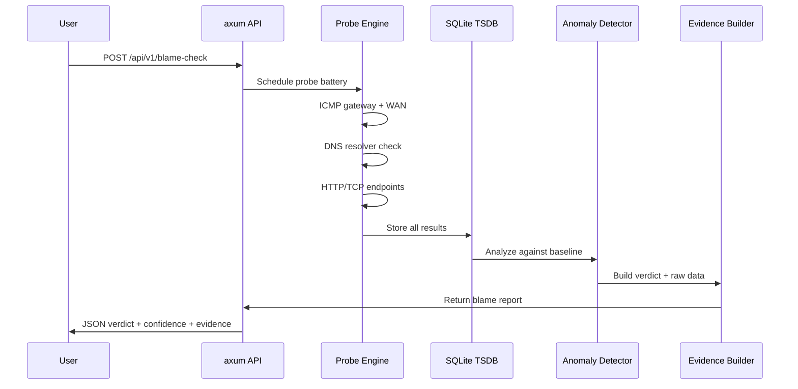

<p align="center">
  <h1 align="center">PacketParamedic</h1>
  <p align="center">
    <strong>Appliance-grade network diagnostics for your home and small office.</strong><br>
    <em>ARM NEON + GPU accelerated. Evidence-driven. Built in Rust.</em>
  </p>
  <p align="center">
    <a href="https://blueoakcouncil.org/license/1.0.0"></a>
    
    
    
    
    
    
    
    
    
    
    
    
    
    
    
  </p>
</p>

---

## What is PacketParamedic?

PacketParamedic is a Raspberry Pi-based network diagnostic appliance that answers one question with evidence:

> **"Is it my Wi-Fi, my router, or my ISP?"**

It runs unattended, collects structured measurements over time, detects anomalies, and produces shareable evidence bundles you can hand to your ISP or use to troubleshoot yourself.

### Key Capabilities

- **Blame attribution** -- Distinguishes LAN, Wi-Fi, router, DNS, and ISP issues with evidence.
- **Continuous monitoring** -- Scheduled ICMP, HTTP, DNS, and TCP probes build a baseline over days and weeks.
- **Incident detection** -- Statistical anomaly detection flags latency spikes, packet loss, route changes, and DNS shifts.
- **Evidence bundles** -- Export timestamped, redacted reports suitable for ISP support tickets.
- **Hardware self-test** -- Validates Pi hardware, Wi-Fi adapters, thermals, and power integrity before testing.
- **Hardware acceleration** -- ARM NEON SIMD for compute-heavy paths; OpenGL ES 3.1 / Vulkan GPU offload where beneficial.
- **Appliance-grade reliability** -- Survives power cuts, manages disk space, and runs headless with zero maintenance.

---

## Architecture



### Acceleration Pipeline



### Diagnostic Flow



---

## Tech Stack

| Layer | Choice | Rationale |
|---|---|---|
| **OS** | Raspberry Pi OS Lite (Bookworm) | Best Pi hardware support; Wayland-ready for optional local UI |
| **Runtime** | Rust + Tokio + axum + tower | Lightweight async stack; low memory, safe concurrency |
| **Acceleration** | ARM NEON SIMD + OpenGL ES 3.1 / Vulkan | Hardware-accelerated compute on Pi 4/5 with automatic CPU fallback |
| **Storage** | SQLite (WAL mode) | Zero-ops local-first event store; crash-safe concurrent access |
| **UI** | Server-rendered HTML + htmx | No SPA build pipeline; fast on low-power hardware |
| **Observability** | `tracing` + `tracing-journald` | Structured logs into journald; great for support bundles |
| **Services** | systemd units + tmpfiles.d | Appliance-grade supervision, easy rollback and diagnostics |
| **Remote admin** | Tailscale (optional) | Zero-trust, no inbound ports, WireGuard encrypted |
| **BLE** | BlueZ + bluer (optional) | Nearby provisioning and recovery via GATT |
| **Cellular** | SIM HAT/modem (optional) | Out-of-band management when WAN is down |

---

## Getting Started

### Prerequisites

- Raspberry Pi 4 or 5 (2 GB+ RAM recommended)
- Raspberry Pi OS Lite (Bookworm, 64-bit)
- Rust toolchain (`rustup` -- see [rustup.rs](https://rustup.rs))
- SQLite 3.35+

### Build

```bash
# Clone the repository
git clone https://github.com/ParkWardRR/PacketParamedic.git
cd PacketParamedic

# Build in release mode (enables NEON auto-vectorization)
cargo build --release

# Run the self-test (checks hardware, Wi-Fi, thermals, acceleration)
./target/release/packetparamedic self-test
```

### Cross-compile for Raspberry Pi (from x86)

```bash
# Install the target
rustup target add aarch64-unknown-linux-gnu

# Build with cross (handles sysroot and linker)
cross build --release --target aarch64-unknown-linux-gnu
```

### Run

```bash
# Start the daemon (uses systemd in production)
./target/release/packetparamedic serve

# Quick blame check from CLI
./target/release/packetparamedic blame-check
```

The web UI is available at `http://<pi-ip>:8080` once the server is running.

---

## Usage

### CLI

```bash
# Run hardware self-test (board, Wi-Fi adapters, thermals, NEON/GPU detection)
packetparamedic self-test

# Run a blame check ("Is it me or my ISP?")
packetparamedic blame-check

# Export an evidence bundle for your ISP
packetparamedic export-bundle --output report.zip

# Check service status
systemctl status packetparamedic
```

### API

All functionality is exposed via a local REST API:

```bash
# Trigger a blame check
curl -X POST http://localhost:8080/api/v1/blame-check

# Get the latest self-test report
curl http://localhost:8080/api/v1/self-test/latest

# List recent incidents
curl http://localhost:8080/api/v1/incidents?limit=10

# Export a support bundle
curl -X POST http://localhost:8080/api/v1/export/bundle -o bundle.zip
```

---

## Project Structure

```
PacketParamedic/
├── src/
│   ├── main.rs            # Entry point and CLI
│   ├── lib.rs             # Library root for testability
│   ├── api/               # axum routes and handlers
│   ├── probes/            # ICMP, HTTP, DNS, TCP probe implementations
│   ├── storage/           # SQLite schema, queries, migrations
│   ├── detect/            # Anomaly detection and incident grouping
│   ├── evidence/          # Report and bundle generation
│   ├── selftest/          # Hardware, Wi-Fi, thermal self-test
│   └── accel/             # Acceleration manager (NEON / GPU / CPU fallback)
├── templates/             # HTML templates for htmx UI
├── static/                # CSS, minimal JS
├── systemd/               # Unit files for deployment
├── tests/                 # Integration and soak test harnesses
├── benches/               # Acceleration benchmarks
├── roadmap.md             # Development roadmap (checklist)
├── CONTRIBUTING.md        # Development plan, standards, and best practices
└── README.md
```

---

## Acceleration

PacketParamedic uses a tiered acceleration strategy on Raspberry Pi 4/5 hardware:

| Tier | Technology | Use Case | Fallback |
|---|---|---|---|
| **SIMD** | ARM NEON (ASIMD) | Batch metric computation, statistical analysis | Scalar CPU |
| **GPU Compute** | OpenGL ES 3.1 | Parallel data processing where beneficial | CPU + NEON |
| **GPU Render** | Vulkan (optional) | Future: local HDMI dashboard rendering | OpenGL ES |

**Correctness guarantee:** Every accelerated codepath has a reference CPU implementation. Both must produce identical results. The acceleration manager records which path was used for every operation, ensuring reproducible diagnostics.

---

## Contributing

Contributions are welcome. Please read [`CONTRIBUTING.md`](CONTRIBUTING.md) for coding standards, branch conventions, and testing requirements before submitting a PR.

### Quick Guidelines

1. **Fork and branch** from `main`.
2. **Write tests** for new functionality.
3. **Run `cargo clippy` and `cargo fmt`** before committing.
4. **Keep PRs focused** -- one feature or fix per PR.
5. **Document "why"** in commit messages, not "what".

---

## Security

PacketParamedic is designed as a network appliance with a strong security posture:

- No default passwords; authentication required for all API access.
- Minimal open ports (only the local web UI port by default).
- All actions are auditable via journald.
- Optional features (monitor mode, injection testing) require explicit opt-in.
- Tailscale integration uses zero-trust networking with no inbound WAN ports.
- Each systemd service runs with least-privilege capabilities (`CAP_NET_RAW`, `CAP_NET_ADMIN`).
- Supply chain secured via `cargo audit` + `cargo deny` on every build.

To report a security issue, please open a private advisory on GitHub.

---

## License

[Blue Oak Model License 1.0.0](https://blueoakcouncil.org/license/1.0.0) (SPDX: `BlueOak-1.0.0`)
