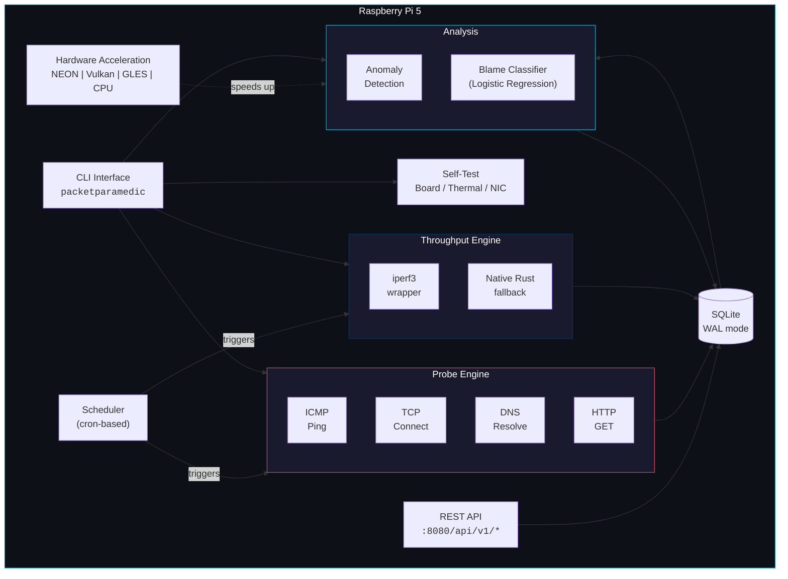
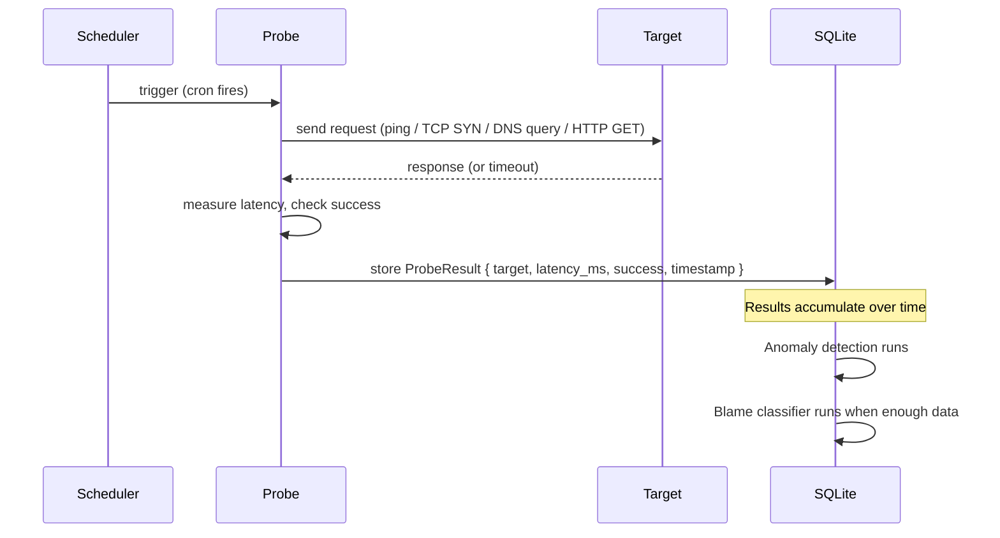
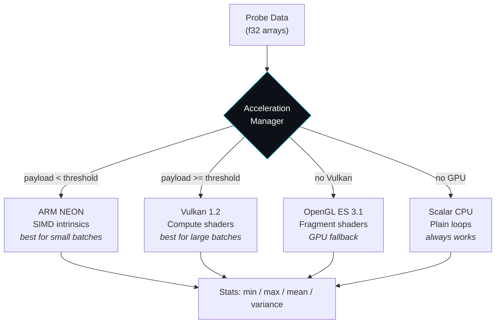
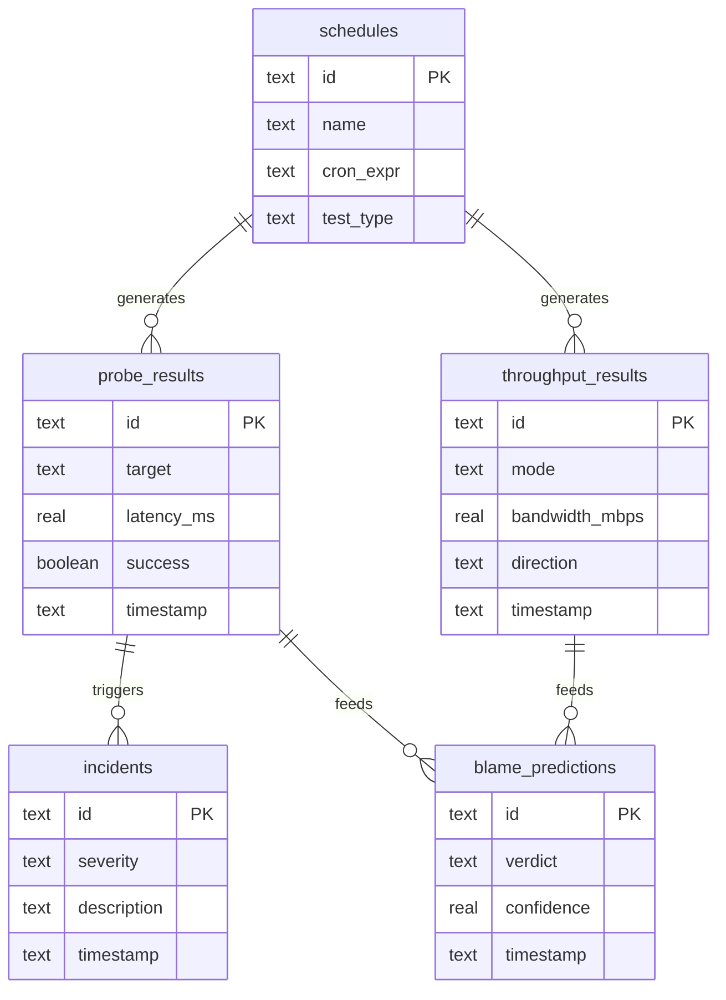

<p align="center">
  
</p>

<p align="center">
  <strong>Your Raspberry Pi 5 just became a network doctor.</strong><br/>
  Automated diagnostics, speed tests, anomaly detection, and blame analysis — all in one box.
</p>

---

## Badges

<table>
<tr><th colspan="2">Project</th></tr>
<tr>
  <td>Version</td>
  <td>
    
  </td>
</tr>
<tr>
  <td>License</td>
  <td>
    
  </td>
</tr>
<tr>
  <td>Edition</td>
  <td>
    
  </td>
</tr>
<tr>
  <td>MSRV</td>
  <td>
    
  </td>
</tr>
<tr><th colspan="2">Stack</th></tr>
<tr>
  <td>Runtime</td>
  <td>
    
    
  </td>
</tr>
<tr>
  <td>Database</td>
  <td>
    
  </td>
</tr>
<tr>
  <td>CLI</td>
  <td>
    
  </td>
</tr>
<tr>
  <td>DNS</td>
  <td>
    
  </td>
</tr>
<tr>
  <td>HTTP</td>
  <td>
    
  </td>
</tr>
<tr><th colspan="2">Target Hardware</th></tr>
<tr>
  <td>Platform</td>
  <td>
    
  </td>
</tr>
<tr>
  <td>CPU Tuning</td>
  <td>
    
  </td>
</tr>
<tr>
  <td>GPU Accel</td>
  <td>
    
    
  </td>
</tr>
<tr><th colspan="2">Build</th></tr>
<tr>
  <td>Release</td>
  <td>
    
    
    
  </td>
</tr>
<tr>
  <td>Packaging</td>
  <td>
    
    
    
  </td>
</tr>
</table>

---

## What is this thing?

You know when your WiFi starts acting up and you have no idea if it's *your* router, *your ISP*, or the website itself? That's the problem.

**PacketParamedic** is a Rust program that turns a Raspberry Pi 5 into a dedicated network detective. It sits on your network, runs tests on a schedule, stores everything in a local database, and when things go wrong it tells you **whose fault it is** — yours, your ISP's, or the service you're trying to reach.

It does this by firing off probes (ping, TCP, DNS, HTTP), running speed tests, tracking anomalies over time, and feeding everything into a blame classifier that says: "yeah, it's your ISP" or "nah, that's on you."

---

## How it works (the big picture)



---

## The probe lifecycle

Every probe follows the same pattern: fire a request, measure how long it takes, record whether it worked, store the result.



---

## Blame analysis — who broke my internet?

This is the coolest part. PacketParamedic doesn't just tell you "the network is down" — it tells you **who to yell at**.

```mermaid
flowchart LR
    subgraph INPUTS["13 Features"]
        A["Gateway RTT + Loss"]
        B["WAN RTT + Loss"]
        C["DNS Latency + Fail Rate"]
        D["HTTP + TCP Fail Rates"]
        E["Throughput Metrics"]
    end

    subgraph MODEL["Logistic Regression"]
        W["Weighted Sum<br/>+ Sigmoid"]
    end

    subgraph VERDICT["Verdict"]
        ME["🏠 <b>me</b><br/>Your network/hardware"]
        ISP["🌐 <b>isp</b><br/>Your internet provider"]
        SVC["☁️ <b>service</b><br/>The remote server"]
    end

    INPUTS --> MODEL --> VERDICT

    style INPUTS fill:#1a1a2e,stroke:#e94560,color:#fff
    style MODEL fill:#1a1a2e,stroke:#00b4d8,color:#fff
    style VERDICT fill:#1a1a2e,stroke:#00ff88,color:#fff
```



The model looks at data from all the probes and speed tests, calculates a score for each possible cause, and picks the most likely one with a confidence percentage.

---

## Hardware acceleration pipeline

When you're crunching numbers on thousands of probe results, the Pi's GPU can actually help. The acceleration manager picks the fastest available backend automatically.



---

## Project structure

```
src/
├── main.rs              # CLI entrypoint (clap commands)
├── lib.rs               # crate root
├── probes/              # ICMP, TCP, DNS, HTTP — the eyes and ears
├── throughput/          # iperf3 wrapper + native Rust speed tests
├── scheduler/           # cron engine, profiles, concurrency control
├── storage/             # SQLite schema, migrations, WAL setup
├── accel/               # NEON, Vulkan, GLES, CPU fallback
├── analysis/            # blame classifier (logistic regression)
├── detect/              # anomaly detection, incident severity
├── selftest/            # hardware validation (is this actually a Pi 5?)
├── system/              # NTP sync, disk health
├── evidence/            # support bundle export
└── api/                 # REST API (Axum)
config/
└── schedules.toml       # default cron schedules
systemd/                 # service files for daemon mode
fixtures/                # test data (iperf3 outputs at 1G–100G)
tools/                   # CI, .deb builder, container builder
```

---

## CLI usage

```bash
# start the daemon (API + scheduler)
packetparamedic serve --bind 0.0.0.0:8080

# run a hardware self-test
packetparamedic selftest

# who broke my internet?
packetparamedic blame-check

# run a speed test
packetparamedic speed-test --mode wan --duration 30s --streams 1

# manage scheduled tests
packetparamedic schedule list
packetparamedic schedule add --name "nightly" --cron "0 3 * * *" --test speed-test-light
packetparamedic schedule dry-run --hours 24

# export a support bundle
packetparamedic export-bundle --output bundle.zip
```

---

## API endpoints

All routes live under `/api/v1` and return JSON.

| Method | Route | What it does |
|--------|-------|-------------|
| `GET` | `/health` | Status + version |
| `GET` | `/self-test/latest` | Last hardware self-test result |
| `GET` | `/incidents` | Detected anomalies |
| `GET` | `/probes/status` | Active probe count |
| `GET` | `/speed-test/latest` | Most recent speed test |
| `GET` | `/speed-test/history` | All past speed tests |
| `GET` | `/schedules` | Configured cron schedules |
| `GET` | `/schedules/dry-run` | Preview upcoming scheduled runs |
| `GET` | `/network/interfaces` | Detected network interfaces |

---

## Default schedules

These ship out of the box in `config/schedules.toml`:

| Schedule | Cron | What it runs |
|----------|------|-------------|
| Gateway ping | `* * * * *` | ICMP probe to your router (every minute) |
| DNS + HTTP check | `*/5 * * * *` | DNS resolve + HTTP GET (every 5 minutes) |
| Nightly speed test | `0 3 * * *` | WAN throughput test (3 AM daily) |
| Weekly blame check | `0 4 * * 0` | Full blame analysis (4 AM every Sunday) |

Only one heavy test (speed/throughput) runs at a time — there's a semaphore that prevents overlap.

---

## Building from source

```bash
# standard build
cargo build --release

# cross-compile for Raspberry Pi 5
cross build --release --target aarch64-unknown-linux-gnu

# run the full local CI (format, lint, test, build)
./tools/ci-local.sh

# build a .deb package
./tools/build-deb.sh

# build a container image
./tools/build-container.sh
```

---

## Environment variables

| Variable | Default | Description |
|----------|---------|------------|
| `PP_BIND_ADDR` | `0.0.0.0:8080` | Daemon listen address |
| `PP_DB_PATH` | — | SQLite database path |
| `PP_LOG_LEVEL` | `info` | Log verbosity (`trace` / `debug` / `info` / `warn` / `error`) |
| `PP_DATA_DIR` | — | Data storage directory |
| `PP_IPERF3_PATH` | — | Path to iperf3 binary |
| `PP_SCHEDULER_ENABLED` | — | Enable/disable cron scheduler |
| `PP_SPEED_TEST_WINDOW` | — | Cron expression for allowed speed test windows |
| `PP_DAILY_BW_BUDGET_GB` | — | Daily bandwidth cap for automated tests |

---

## Database

SQLite with WAL (Write-Ahead Logging) for crash safety. Key tables:



---

## License

[Blue Oak Model License 1.0.0](https://blueoakcouncil.org/license/1.0.0) — a permissive license that gives you maximum freedom to use, modify, and distribute this software while protecting contributors from liability.
