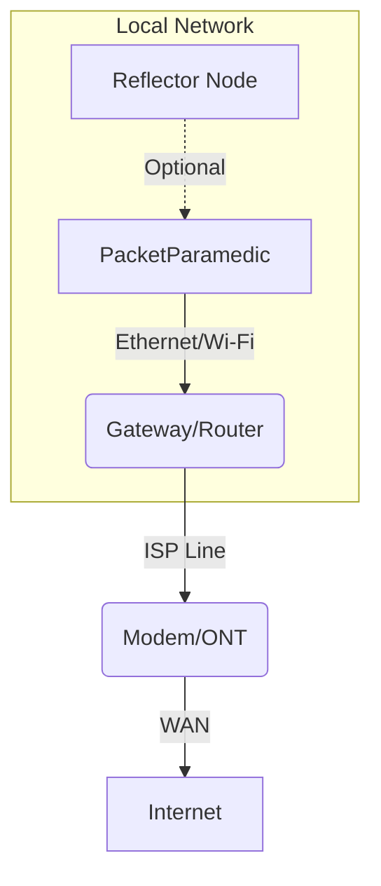

<!--
PacketParamedic — Blame Analysis Template (v2)
Goal: ELI15 Top / Prosumer Bottom. "Brass facts" first, "Deep Dive" second.
-->

# Blame Analysis: <REPORT NAME>

## 🚨 The Verdict (ELI15)
**Is it my internet?** `<YES / NO / MAYBE>`
**Whose fault is it?** `<ME / ISP / SERVICE>`
**Confidence:** `<0-100%>`

### What is happening?
> *Write 1-2 simple sentences here. Example: "Your Wi-Fi signal is too weak, causing Netflix to buffer. The internet connection to your house is fine."*

### What should I do?
1.  **Action 1:** `<e.g., Move closer to the router.>`
2.  **Action 2:** `<e.g., Restart the modem.>`

---

## 🔬 The Evidence (The "Brass Facts")
| Test | Result | Grade | Meaning |
|---|---|---|---|
| **Hardware Health** | `<PASS/WARN/FAIL>` | `<A-F>` | Is the Pi itself healthy? |
| **Wi-Fi Connection** | `<Signal dBm>` | `<A-F>` | Connectivity to Router. |
| **Internet Speed** | `<Down> / <Up> Mbps` | `<A-F>` | Raw capacity vs Plan. |
| **Stability (Loss)** | `<0-100>%` | `<A-F>` | Are packets getting lost? |
| **Responsiveness** | `<Latency> ms` | `<A-F>` | Gaming/Call quality (Lag). |

---

<br>
<br>

# 🛠️ Deep Dive (Prosumer / Technical)

## 1. Local Network Architecture


## 2. System & Hardware Self-Test
**Context:** *Validating the observer. If the doctor is sick, the diagnosis is suspect.*
| Component | Status | Details |
|---|---|---|
| **CPU/Thermal** | `<Temp>°C` | Throttled: `<Yes/No>` |
| **Storage** | `<Type>` | `<Free Space>` |
| **Ethernet** | `<Speed>` | Link verified. |
| **Wi-Fi Interface** | `<State>` | `<SSID>` |

## 3. Comparative Analysis: Ethernet vs. Wi-Fi
*Test both paths to isolate if the issue is wireless interference.*

| Metric | Ethernet (Wired) | Wi-Fi (Wireless) | Delta |
|---|---|---|---|
| **Download** | `<Mbps>` | `<Mbps>` | `<Diff>` |
| **Upload** | `<Mbps>` | `<Mbps>` | `<Diff>` |
| **Latency** | `<ms>` | `<ms>` | `<Diff>` |
| **Jitter** | `<ms>` | `<ms>` | `<Diff>` |
| **Packet Loss** | `<%>` | `<%>` | `<Diff>` |

## 4. Signal Intelligence (Wi-Fi Analytics)
| Feature | Observed Value | Optimal Range | Assessment |
|---|---|---|---|
| **SSID** | `<Name>` | - | Correct Network? |
| **BSSID** | `<MAC>` | - | Roaming Check. |
| **RSSI (Signal)** | `<dBm>` | > -65 dBm | **Strong/Weak** |
| **Link Rate** | `<Mbps>` | Max Supported | PHY Health. |
| **Frequency** | `<GHz>` | 5/6 GHz | Band Congestion. |

## 5. Path Analysis (MTR / Traceroute)
*Where is the break? LAN vs WAN vs Backbone.*

**Target:** `8.8.8.8` (Google DNS)
```
<PASTE MTR OUTPUT HERE>
```
*Key Hops Analysis:*
- **Hop 1 (Gateway):** `<Latency/Loss>` — Local Issue?
- **Hop N (ISP Edge):** `<Latency/Loss>` — Last mile issue?
- **Final Hop:** `<Latency/Loss>` — End-to-end status.

## 6. Full Probe Data
| Probe Target | Protocol | RTT (ms) | Success Rate | Note |
|---|---|---|---|---|
| **Gateway** | ICMP | `<ms>` | `<%>` | Local Link Health. |
| **Google DNS** | UDP/53 | `<ms>` | `<%>` | WAN Connectivity. |
| **Web (Google)** | HTTP | `<ms>` | `<%>` | Application Layer. |
| **Reflector** | TCP/UDP | `<ms>` | `<%>` | LAN Benchmark. |

---
*Generated by PacketParamedic on <TIMESTAMP>*
