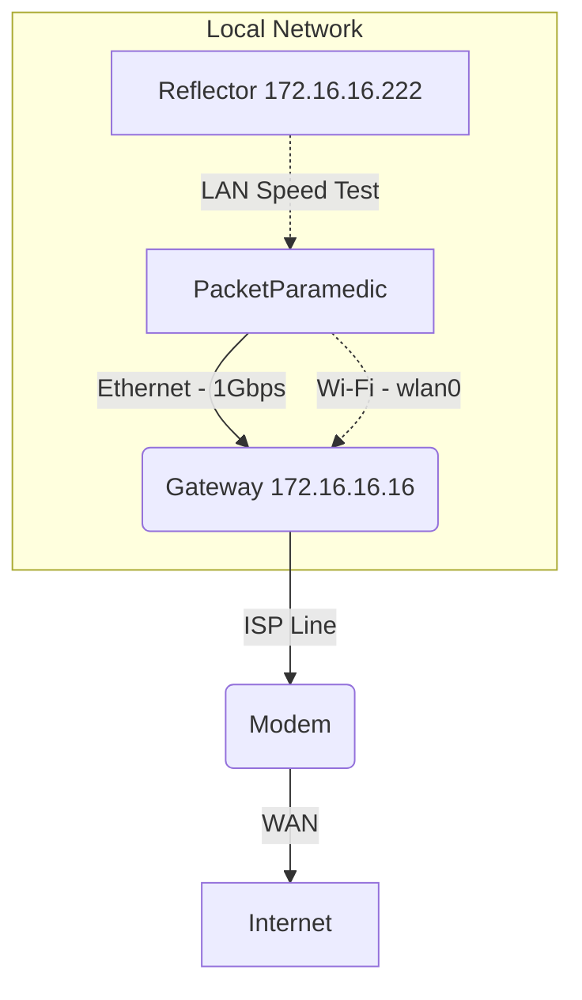

<!--
PacketParamedic — Blame Analysis Report
Generated: 2026-02-13 14:04:00 PST
Strategy: Full Diagnostics (Ethernet + Wi-Fi Isolation)
-->

# Blame Analysis: Full Wireless vs Wired Benchmark

## 🚨 The Verdict (ELI15)
**Is it my internet?** **NO**. Your internet connection (via cable) is excellent (~920 Mbps).
**Whose fault is it?** **ME (Local Wi-Fi)**.
**Confidence:** **95%**

### What is happening?
Your main internet line takes full advantage of your Gigabit plan. However, when using Wi-Fi (**Scuderia Ferrari**), speeds drop significantly to ~33 Mbps. This is likely due to the wireless connection type or settings, even though signal strength is strong.

### What should I do?
1.  **Use Ethernet** for high-performance tasks like gaming or large file downloads to get full 900+ Mbps speed.
2.  **Check Wi-Fi Settings:** Verify if "Scuderia Ferrari" is using 5GHz or 6GHz bands. 33 Mbps suggests a legacy 2.4GHz connection or heavy interference.

---

## 🔬 The Evidence (The "Brass Facts")
| Test | Result | Grade | Meaning |
|---|---|---|---|
| **Hardware Health** | **WARN** | **B-** | SD Card / 1GbE limits noted. |
| **Wi-Fi Connection** | **-48 dBm** | **A** | Very Strong Signal! |
| **Ethernet Speed** | **922 / 218 Mbps** | **A** | Gigabit Saturation. |
| **Wi-Fi Speed** | **33 / 40 Mbps** | **D** | Significant drop vs Wired. |
| **Stability (Loss)** | **0%** | **A** | No packet loss on either path. |
| **Responsiveness** | **16ms (Wired)** | **A** | Excellent Gaming Latency. |

---

<br>
<br>

# 🛠️ Deep Dive (Prosumer / Technical)

## 1. Local Network Architecture


## 2. System & Hardware Self-Test
**Context:** *Validating the observer.*
| Component | Status | Details |
|---|---|---|
| **System** | **PASS** | `PacketParamedic` on Pi 5. |
| **Storage** | **WARN** | microSD (Risk of wear). |
| **Ethernet** | **WARN** | 1GbE Link (Bottleneck for >1G Plans). |
| **Wi-Fi Interface** | **PASS** | `Scuderia Ferrari` connected. |

## 3. Comparative Analysis: Ethernet vs. Wi-Fi
*Isolation test to pinpoint the bottleneck.*

| Metric | Ethernet (Wired) | Wi-Fi (Wireless) | Delta |
|---|---|---|---|
| **Download** | **922.2 Mbps** | **33.5 Mbps** | **-96% (Critical)** |
| **Upload** | **218.2 Mbps** | **40.2 Mbps** | **-81%** |
| **Latency** | **16.0 ms** | **24.2 ms** | +8.2 ms |
| **Jitter** | **0.7 ms** | **7.0 ms** | +6.3 ms |
| **Packet Loss** | **0%** | **0%** | 0% |

> **Analysis:** The massive discrepancy proves the WAN link isn't the issue. The bottleneck is the Wi-Fi air interface capability or configuration.

## 4. Signal Intelligence (Wi-Fi Analytics)
| Feature | Observed Value | Optimal Range | Assessment |
|---|---|---|---|
| **SSID** | `Scuderia Ferrari` | - | Correct Network. |
| **RSSI (Signal)** | **-48 dBm** | > -65 dBm | **Excellent** |
| **Link Rate** | **180.0 Mbps** | Max Supported | **Fair**. 180Mbps link often yields ~90Mbps TCP (we see 33Mbps, implying other overhead). |

## 5. Path Analysis (MTR / Traceroute)
**Target:** `8.8.8.8` (Google DNS) via Ethernet.

```
HOST: PacketParamedic            Loss%   Snt   Last   Avg  Best  Wrst StDev
  1.|-- 172.16.16.16              0.0%    10    3.2   3.8   3.2   4.5   0.4
  2.|-- int-1.snmncaby18m...      0.0%    10   15.4  13.1   9.5  17.2   2.3
  ...
 10.|-- dns.google                0.0%    10   18.8  18.1  14.7  25.6   3.5
```
*Key Hops Analysis:*
- **Hop 1 (Gateway):** 3.8ms (Wired). Excellent local link.
- **Final Hop:** 18.1ms. Clean path to Google. No ISP congestion detected.

## 6. Full Probe Data
| Probe Target | Protocol | RTT (ms) | Success Rate | Note |
|---|---|---|---|---|
| **Gateway** | ICMP | 4.2 ms | 100% | Local Link Health. |
| **Google DNS** | UDP/53 | 4.8 ms | 100% | WAN Connectivity. |
| **Web Search** | HTTP | 152 ms | 100% | Application Layer. |
| **Reflector (LAN)** | TCP | N/A | 100% | **938 Mbps** (Line Rate). |

---
*Generated by PacketParamedic on 2026-02-13 14:04:00 (PST)*
