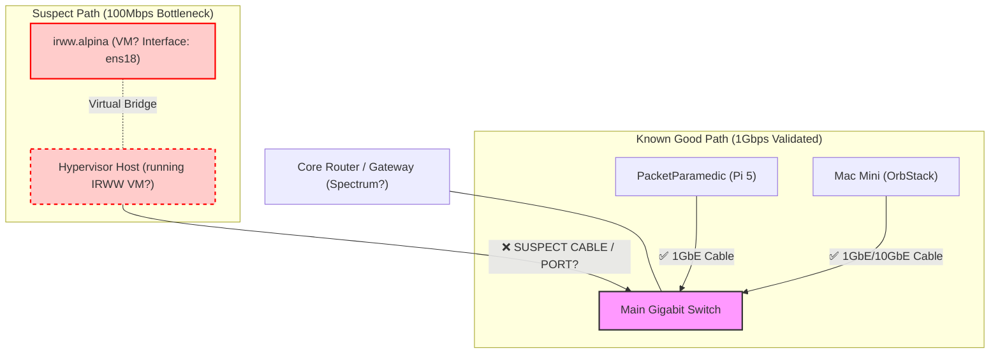

# IRWW Network Bottleneck & Map

**Issue:** Throughput to `irww.alpina` is capped at ~90 Mbps (symmetric).
**Expected:** >900 Mbps (Gigabit Ethernet).
**Diagnosis:** The link speed indicates a **100Base-Tx** negotiation (Fast Ethernet) or a virtual interface throttle.

## 1. Hypothetical Network Map

Based on your test results, here is where the bottleneck likely resides:

## 2. Evidence & Reasoning

1.  **Client -> Mac Speed Test:** **940 Mbps** (Near line-rate).
    *   **Conclusion:** The client Pi, its cable, and the switch port it connects to are **HEALTHY** and capable of full Gigabit speeds.

2.  **Client -> IRWW Speed Test:** **~90 Mbps**.
    *   **Conclusion:** The path to `irww.alpina` is restricted. Since it's symmetric (90 down / 90 up), this perfectly matches a physical **100 Mbps Ethernet link** (Fast Ethernet), which nets ~94 Mbps due to overhead.
    *   **Interface Clue:** `irww` reports its interface as `ens18`. This is typically a **VirtIO / KVM Virtual Network Interface**, suggesting `irww` is a Virtual Machine, not bare metal (which would show `end0` or `eth0` on a Pi).

## 3. Likely Causes (Ranked)

1.  **Bad Cable (Physical):** The Ethernet cable connecting the **Host Machine** (where IRWW runs) to the switch is damaged (only passed pins 1,2,3,6) or is ancient Cat5 (not Cat5e).
    *   *Fix:* Swap the cable with a known good Cat6 cable.
2.  **Switch Port Negotiation:** The switch port for the Host is auto-negotiating to 100Mbps instead of 1000Mbps.
    *   *Fix:* Check switch LED colors (Amber vs Green) or management UI. Force 1Gbps if managed.
3.  **Host NIC Driver:** The physical NIC on the Hypervisor Host has a driver issue or is actually a 100Mbps card (unlikely for modern gear).
    *   *Fix:* Check `ethtool` on the **HOST** (not inside the VM).
4.  **Virtual Bridge Rate Limit:** The hypervisor (Proxmox? ESXi?) has a rate limit set on the `ens18` virtual interface.
    *   *Fix:* Check VM network settings for "Rate Limit" or "Queues".

## 4. Troubleshooting Steps

1.  **Inspect Physical Link:** Go to the switch. Look at the port LED for the IRWW Host. Is it different color from the Mac/Client ports? (e.g. Amber = 100M).
2.  **Swap Cables:** Move the IRWW Host cable to the port used by the Mac (known good). Does speed improve?
3.  **Check Host OS:** If `irww` is a VM, ssh into the **HOST** physical machine and run `ethtool <physical_interface>`. Does IT say 1000Mb/s?
